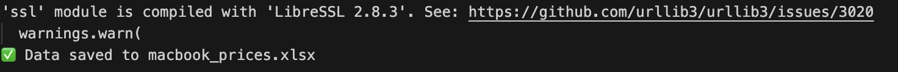

# 🛍️ Flipkart MacBook Price Scraper

This is a Python script that scrapes MacBook product names and prices from [Flipkart](https://www.flipkart.com/) using **ScraperAPI**.

## 📦 Features
- Scrapes product title and price from Flipkart
- Uses ScraperAPI to bypass bot protection
- Outputs clean `.xlsx` file using pandas

## 🖥️ Sample Output

| Product Name        | Price     |
|---------------------|-----------|
| Apple MacBook M4    | ₹1,19,900 |
| MacBook Pro M4 Max  | ₹2,49,900 |

See the file: `products.xlsx`

## 📸 Screenshots

### Terminal:


### Excel Output:


## 🔧 Requirements

- Python 3
- pandas
- requests

Install with:
```bash
pip install -r requirements.txt
